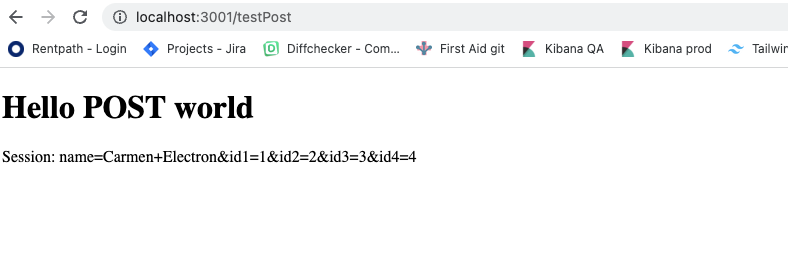

to run the form redirect:
- pull down this repo
- cd into `node-headers`
- run `node index.js`
- in another terminal, cd into `next-app-ts`
- run `npm run dev`
- with both apps running, open your browser and navigate to: `http://localhost:3000/getTestPost`

You'll be redirected, nearly immediately, to `http://localhost:3001/testPost` where you'll see the contents of the form data that was posted.

this will test the flow from one server app to a next app. to test, run initiate both apps, starting with the express server. (its important that the express server runs on port 3000, and the next app runs on 3001)

attempt to reach `localhost:3000`. you'll see a redirect to `localhost:3001` with the headers listed on the page. The express app attempts to add a header before redirecting, and you'll note that the header is not present on `localhost:3001` (because the browser strips out any "random" headers for security).

if you attempt to make an HTTP request to `localhost:3000` and set headers, you'll see the HTML response from `localhost:3001` does include the headers you added (because there is no browser between these two stripping out the headers).